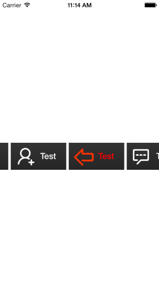
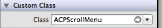

# ACPScrollMenu

This control was designed for a fast implementation of scrollable menu. You just need to add this component directly to the storyboard or your xib file and implement the delegate methods.

Fully customizable, items, colors, padding, backgrounds, animations&behaviour!



## Instalation

### From [CocoaPods][1]

	pod `ACPScrollMenu`

### From source

* Clone the repository

[*$ git clone git@github.com:antoniocasero/ACPScrollMenu.git*]()

* Or just drag this component to your project and import `ACPScrollMenu` to your viewcontroller.

## Implementing

Set your view as `ACPScrollMenu` class



Set your items, and call this method

```
- (void)setUpACPScrollMenu:(NSArray *)menuItems;
```

Fill the delegate method:

```
-(void)scrollMenu:(ACPScrollMenu *)menu didSelectIndex:(NSInteger)selectedIndex;
```

###Items

To initialize your items, choose between delegate methods or blocks:

* If you like blocks, you can initialize the items with:

```
- (id)initACPItem:(UIImage *)backgroundImage iconImage:(UIImage *)iconImage label:(NSString *)labelItem andAction:(actionBlock)block;
```
* If you want to use delegate methods, you can use:

```
- (id)initACPItem:(UIImage *)backgroundImage iconImage:(UIImage *)iconImage andLabel:(NSString *)labelItem;
```
* if you want a custom highlighted state for you item

```
- (void)setHighlightedBackground:(UIImage *)backgroundImageHightlighted iconHighlighted:(UIImage *)iconImageHighlighted textColorHighlighted:(UIColor *)texColorHighlighted
```

## Compatibility

- Supports ARC. 
- Compatible with iOS5+.


## License

`ACPScrollMenu` is available under the MIT license. See the LICENSE file for more info.


[1]:	http://www.cocoapods.org


[](https://bitdeli.com/free "Bitdeli Badge")

